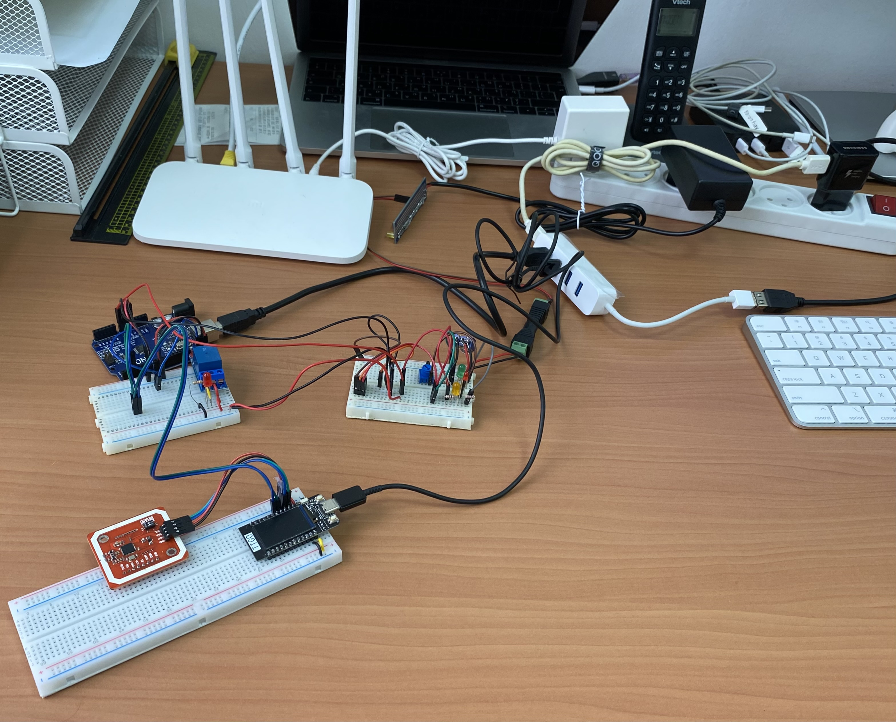
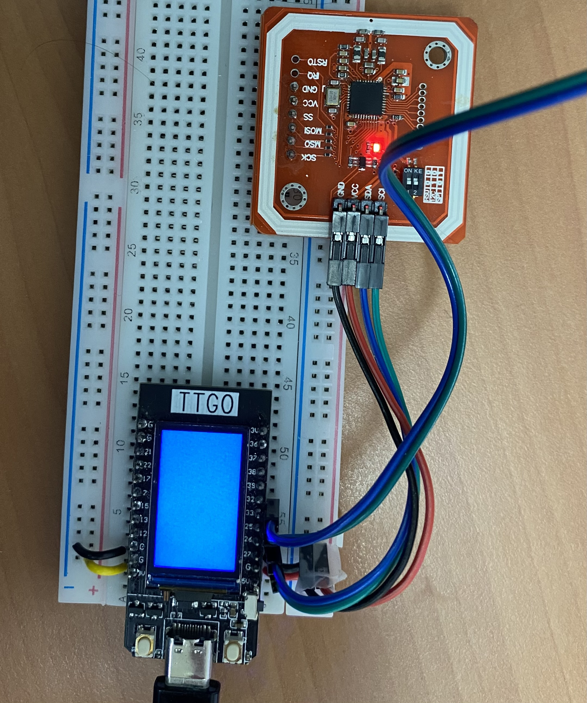
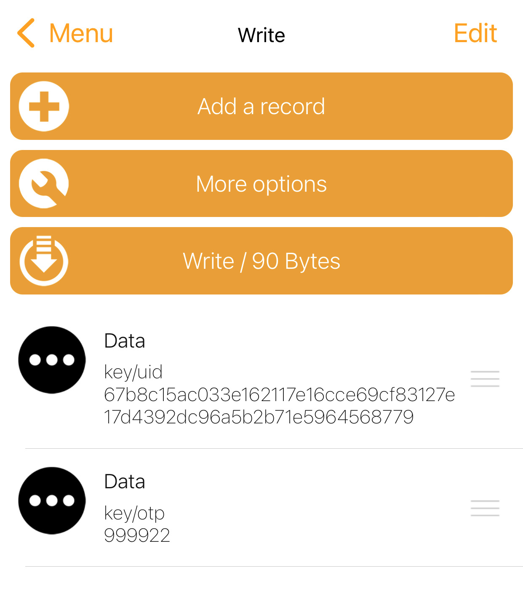
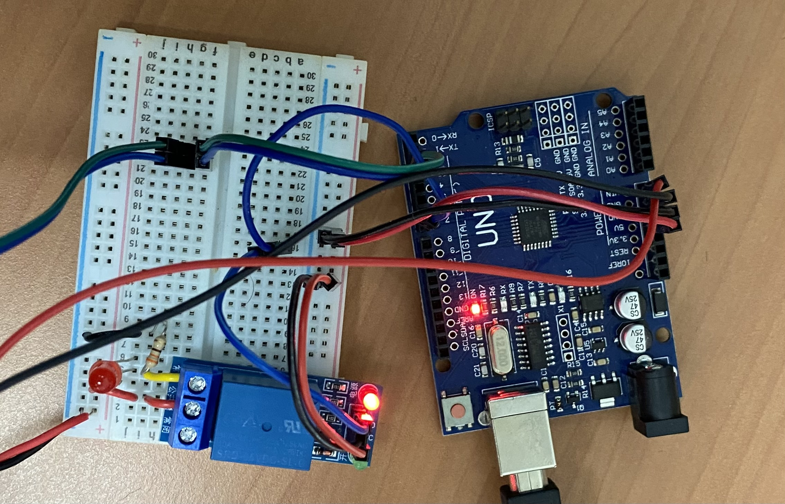

# PoC Project: Blockchain and IoT for Managing an Organization
This project is a proof of concept for managing an organization and controlling the various devices in it via smart contracts that are executed on a private blockchain.



Warning: This project and the code is published for experimentation purposes only.
Many aspects related to real-world uses were purposley ignored such as the integrity of the smart contracts, certificate permission verification or even service level authentication and authorization.
This repo is neither regularly maintained nor meant for production use cases.

## Prerequisites 
The following pieces of software and hardware are assumed to be present:
- An Ethereum-like blockchain network that is compatible with `truffle` and `Web3js`
    - Use the `ganache` utility to spawn a local testing network
- A local network with wireless connectivity
- A device with NFC-tag writing capabilities
    - E.g. [NFC Tools iOS App](https://apps.apple.com/us/app/nfc-tools/id1252962749) on a mobile phone
- A Redis Server
    - Command: `$ docker run --name some-redis -d redis`
- A radius server (See the relevant section) and an EAP-TLS capable access point (along with an end-user device)
- A Door Module and a Door Controller Module (See the relevant sections)

## Smart Contract Backend
The provided smart contracts mimic the concepts of organization management with solidity code.
See the following interfaces.

Employees each have a private key associated with their Ethereum address. 
They also have a unique ID that is independent of the Ethereum address and can be assigned by the organization.
In contrast to the Ethereum address which is derived from the public key, the ID above has no such restrictions. 

An employee management contract creates an "employment" contract that is used to manage the specific employee. 

```solidity
interface IEmployee {
    function employee_id() external view returns (bytes32);
    function employee_name() external view returns (string memory);
    function employee_address() external view returns (address);
}

interface IEmployeeManagment {
    function is_manager(address id) external view returns (bool);
    function is_employee_active(address addr) external returns(bool);

    function get_employee_address(address addr) external view returns(bool, IEmployee);
}
```

The organization may have various endpoints through which employees may access the organization's resources.

Access control to the different endpoints is done via tickets that are issued with solidity events. 
Each endpoint must keep track of the current tickets that have been issued and their validity periods.

Tickets are issued to a specific employee, if and only if the employee has sufficient permissions to access the endpoint.
The permission checking is encoded in the smart contacts themselves. 

Tickets also carry payload data, that is used to authenticate the user at the endpoint itself, without requiring a completely new blockchain transaction upon each access.
The authentication which is used at each endpoint is decoupled from the actual account (and its corresponding private key) used by the employee so that endpoints aren't limited to the private key itself.
```solidity
struct Ticket {
    // uint256 random;
    uint timestamp;
    
    bytes32 endpoint_id;
    bytes32 employee_id;

    uint64 validity_length;

    string data;
}

interface ITicketGranter {
    event TicketIssued(Ticket ticket);
    event TicketRejected(Ticket ticket);

    function CreateTicket(IEndPoint endpoint, string calldata data) external returns(bool);
}
```

## Network Endpoint with 802.1X EAP-TLS Authentication and Certificates
The first example of a type of endpoint relies on x509 certificates.
Each employee issues a ticket with a self-signed CA certificate as its payload.

The CA is linked to the specific employee and employee id, such that all sub-certificates can only authorize the same employee.
This should be checked by the smart contract that receives the certificate. 

These assertions are not performed in the current implementations, due to the limitations of the current version of Solidity.
These limitations can be resolved by adding custom instructions to the instruction set allowing for x509 certificate processing.
Alternatively, it can be solved using distributed oracles. 

Creating an example certificate CA and a sub-certificate for TLS usage can be done with the provided utility:

```bash
$ cd radius-server/make_certs
$ uid="67b8c15ac033e162117e16cce69cf83127e17d4392dc96a5b2b71e5964568779" make all
```

Also, the following script tracks all tickets issued by a given ticket granter and stores them in a Redis cluster.

```bash
$ cd smart-contracts
$ truffle exec scripts/log_tickets_certs.js
```

Lastly, a ticket can be issued via the following script:
```bash
$ cd smart-contracts
$ truffle exec scripts/issue_ticket.js "<ca_file.pem>"
```
Note: You may need to adjust the corresponding parameters in the scripts.

### 802.1X EAP-TLS Authentication with a RADIUS Server
The `radius-server` folder contains an executable freeRADIUS server for authenticating users via EAP-TLS with certificates that were issued with tickets as described above. 

To build the docker image and executed the server, run the following:
```bash
$ cd radius-server
$ ./build.sh
$ ./run.sh
```
You must update the following two files in the `/etc/raddb` directory for configuring the endpoint id and the address of the redis server. 
These files are `/etc/raddb/endpoint_id` and `/etc/raddb/redis_uri`.

The radius server is configured to use the `cert_verify.sh <cert.pem>` to verify client certificates.
The script extracts the employee's id number (the UID field) and uses it to search for a corresponding CA certificate in the redis server.
If such a certificate exists and the chain of trust is vaild, the script accepts the certificate; otherwise, it rejects it.

```bash
#!/bin/bash

...

tls_client_cert_all_json=$(jc --x509-cert < "$tls_client_cert_pem")
if [ $? -ne 0 ]; then
    echo "X509 to JSON Decode error"
    exit 1
fi

user_id=$(jq '.[0].tbs_certificate.subject.user_id' < <(echo "$tls_client_cert_all_json"))
if [ $? -ne 0 ]; then
    echo "User-ID not found in ceritifcate"
    exit 1
fi
user_id=${user_id:1:64}

key="endpoint_0x$ENDPOINT/tickets/employee_0x$user_id/cert"

tempfile=$(mktemp)
redis-cli -u "$redis_uri" --raw GET "$key" > "$tempfile"
if [ $? -ne 0 ]; then
    echo "Error with redis query"
    rm "$tempfile"
    exit 1
fi
ca_cert="$tempfile"

if ! $openssl verify -CAfile "$ca_cert" "$ca_cert" > /dev/null 2>&1; then
    echo "Invalid CA Certificate"
    rm "$tempfile"
    exit 1
fi

cert_in="$tls_client_cert_pem"

$openssl verify -CAfile "$ca_cert" "$cert_in"; err_code=$?

rm "$tempfile"

exit $err_code
```

Then, testing the Radius server can be done from within the container via the `eapol_test` utility:
```bash
$ eapol_test -c /etc/raddb/eapol_test.conf -s freeradius_localhost_secret
```
The value `freeradius_localhost_secret` is the shared secret defined in `/etc/raddb/clients.conf` file. 
It is used for the RADIUS connection between the Authenticator (the access point) and the Authenticating Server (the RADIUS server). 

The certificates that the client uses in the test are defined in the `/etc/raddb/eapol_test.conf` file.
```conf
network = {
    ssid="DoesNotMatterForThisTest"
    key_mgmt=WPA-EAP
    eap=TLS

    # The email address of the employee. Must match the certificate subject.
    identity="67b8c15ac033e162117e16cce69cf83127e17d4392dc96a5b2b71e5964568779@example.com"

    # The CA certificate that signed the certifcate of the server's side
    # Used in the TLS handshake
    ca_cert="/etc/raddb/certs/ca.pem"

    # The certificate used for the client's side in the TLS handshake
    client_cert="/etc/raddb/certs/client_8779.pem"

    # The corresponding private key
    private_key="/etc/raddb/certs/client_8779.key"

    # The private key encryption password 
    # defined in the /**/make_certs/**/client.cnf
    private_key_passwd="whatever_pass" 

    eapol_flags=3
}
```

Note that due to a limitation imposed by the current implementation of freeRADIUS, unknown root CA certificates will cause the validation phase to fail without even triggering the provided verification script.
All root certificates must be listed in the `/etc/raddb/certs/cas_client.pem` file, even though the script uses an alternate method for storing trusted root certificates.
At this time, I was not able to override this behavior.

## Physical Endpoint with NFC Communication for TOTP Authentication and Shared Secrets
### Issuing Tickets Containing Symmetric Shared Secrets
The second example of a type of endpoint relies on symmetric shared secrets.
Each employee issues a ticket with a symmetric shared secret as its payload.

The shared secret itself needs to be encrypted via public key cryptography, to prevent any third-party observer from stealing the secret.
This is especially dangerous when using blockchains since all data is publically available to anyone with access to the blockchain network.
The endpoint publishes a public key in its corresponding contract.
The deployment JavaScript script also generates an RSA key pair for the specific endpoint.

When the client issues a shared secret ticket, it encrypts it using the public key before sending the transaction to the blockchain.
```js
let doorEndPoint = await DoorEndPoint.deployed()
let pubk = await doorEndPoint.publicKey()

let secret = createSharedSecret()
let encrtpted_secret = makesecret.encrypt(secret, pubk)

await doorEndPoint.CreateTicket(doorEndPoint.address, encrtpted_secret, {from: employee})
```
This can be done via the following script:
```bash
$ cd smart-contracts
$ truffle exec scripts/issue_ticket_door.js
```
I used a hybrid encrption method such that the shared secret $S$ is encrypted via symmteric encryption with two randomly chosen values - a symmetric key $K$ and an initialization vector $IV$.
The symmetric key $K$ is then encrypted with the endpoint's public key $PK$. 
$$ E_S = AES_{128}\text{-}CBC(S)$$
$$ E_K = RSA\text{-}PKCS1\_PADDING(K)$$
The client the sends the value `encrtpted_secret` $= [E_K, IV, E_S]$ with the transaction.

Also, the following script tracks all tickets issued by a given ticket granter and stores them in a Redis cluster.
```bash
$ cd smart-contracts
$ truffle exec scripts/log_tickets_secret.js
```
During the ticket logging process, the shared secrets are decrypted using the corresponding private key before they are stored in the Redis cluster.


Note: You may need to adjust the corresponding parameters in the scripts.

### TOTP Authentication with NFC Communication
Symmetric shared secrets allow for using popular authentication methods that provide multiple security properties. 
A popular method of authentication is [Time-based One-Time Passwords (TOTP)](https://en.wikipedia.org/wiki/Time-based_one-time_password).
They allow for client-side authentication, while still preventing replay attacks that make use of previously used OTPs.

The OTP can be passed to the endpoint via NFC Communication, with a device that generates the OTP upon use such as a smartphone. 
I used an NDEF message (NFC Data Exchange Format) to encode the required information. 
The message has two data fields:
- The `key/uid/` field with the employee's ID as hex characters
- The `key/otp/` field with the OTP as 6-digit characters

Here is an example NDEF message 
```
 NDEF Message 2 records, 90 bytes
   NDEF Record
     TNF 0x2 Mime Media
     Type Length 0x7 7
     Payload Length 0x40 64
     Type 6B 65 79 2F 75 69 64  key/uid
     Payload 36 37 62 38 63 31 35 61 63 30 33 33 65 31 36 32 31 31 37 65 31 36 63 63 65 36 39 63 66 38 33 31 32 37 65 31 37 64 34 33 39 32 64 63 39 36 61 35 62 32 62 37 31 65 35 39 36 34 35 36 38 37 37 39  67b8c15ac033e162117e16cce69cf83127e17d4392dc96a5b2b71e5964568779
     Record is 74 bytes
   NDEF Record
     TNF 0x2 Mime Media
     Type Length 0x7 7
     Payload Length 0x6 6
     Type 6B 65 79 2F 6F 74 70  key/otp
     Payload 39 39 39 39 32 32  999922
     Record is 16 bytes
```

### Door Module Example with Microcontrollers
The door lock example allows for opening physical doors using an NFC device / Mobile App as the employee's key.
The door module has two components that communicate via a simple serial protocol.
- A generic door controller that handles the NFC processing, and network connections and controls a door latch with a serial communication protocol.
- A programmable door latch, that waits for commands to ack on. When a command is received, the controller opens the door and returns a response when the door is closed.


Demo video https://youtu.be/AamH4xetnSQ
[](https://www.youtube.com/watch?v=AamH4xetnSQ)

#### Generic Door Controller Module
The generic module following components:
- A [lilygo® TTGO T-Display 1.14" LCD esp32 control board](https://www.lilygo.cc/products/lilygo®-ttgo-t-display-1-14-inch-lcd-esp32-control-board?_pos=18&_sid=c786f4283&_ss=r) such that
    - Connects via WiFi to the Redis server
    - Controls an integrated TFT display
    - Communicates with an NFC module via HSU on pins 26 and 27
    - Communicates with the door latch via UART on pins 25 and 33
- A [PN532 NFC / RFID Module](https://www.nxp.com/docs/en/nxp/data-sheets/PN532_C1.pdf) set to HSU mode



The code for the esp microcontroller is in the `door-verifier` folder. 
Some of the libraries needed to be adjusted and modified.
These are included in the `arduino-libraries` folder.

There may also be some difficulties with flashing the board from macOS.
This can be fixed with an additional driver [CH34xVCPDriver.dmg](https://github.com/WCHSoftGroup/ch34xser_macos).

Also, the NFC chip must act as the tag and interact with a mobile device that must act as an NFC tag reader-writer.
This is because of the limitation Apple imposes on iOS devices, limiting the access third-party developers have to the NFC module; especially with tag emulation which is used extensively for contactless payments (only the wallet app can use this functionality).
Thus the device must "write" the NDEF message to the "tag" that is emulated by the PN532 chip.



#### Door Module Interface
The following code snippet describes the generic interface between the door controller module and the door latch.
Communication is performed over UART at a baud rate of 9600.
```ino
#define SERIAL_BAUD     9600
#define READY_STATUS    "0x10"
#define NOTREADY_STATUS "0x11"
#define OPEN_CMD        "0x21"
#define CLOSED_RSP      "0x22"

void loop() {
  wait(serial.available()==0);

  String line = serial.readString(); line.trim();
  
  if(!line.equals(OPEN_CMD)) { return; }
  ...
  Door Openning
  ...
  serial.println(CLOSED_RSP);
  serial.flush();

  delay(1000);
}
```
#### Example Door Module
The door latch module is built using an Arduino Uno and a relay module.
- One [single channel relay module](https://components101.com/switches/5v-single-channel-relay-module-pinout-features-applications-working-datasheet) that can control the flow of high currents suitable for appliances (but not circuitry)
    - Two pins that provide grounding and 5v Vcc
    - One input pin for toggling the relay itself.
      Note that the IN pin needs to be grounded (negative "-" side) for toggling the relay, rather than connected to the 5v Vcc (positive "+" side).
      This may be counter intuative to some people (especially for someone inexperienced as I was at the time).
- The [Arduino Uno](https://store.arduino.cc/products/arduino-uno-rev3)
    - Pins #2 (RX) & #3 (TX) are connected to the corresponding UART pins #25 TX and #33 RX on the door controller
    - Pin #7 is connected to the IN pin on the relay

The code used to program the Arduino microcontroller is in the `door-module` folder. 




